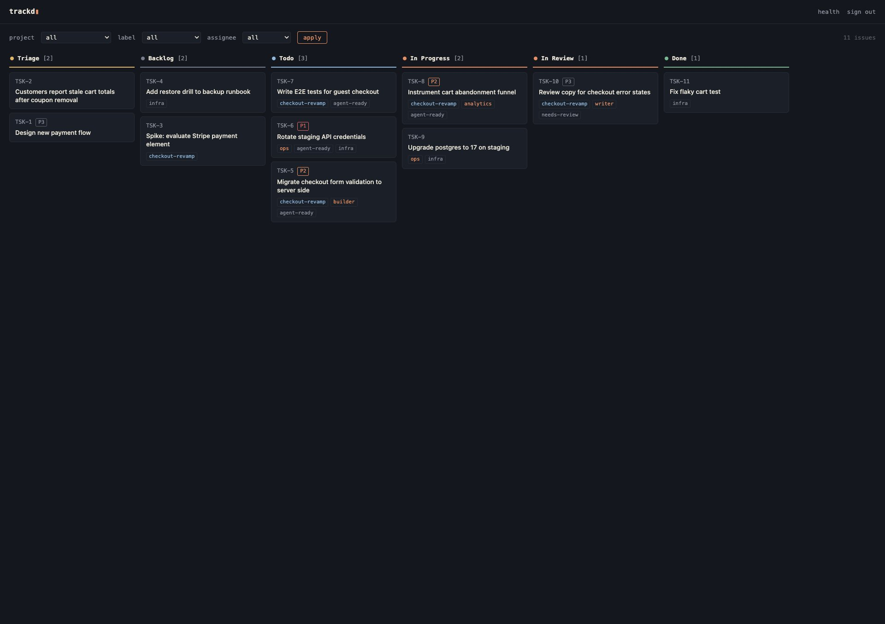

# trackd

Self-hosted task and project tracking for AI agents. One binary, one SQLite file,
three interfaces: REST API, CLI, and MCP, plus a read-only web board for humans.



> **Status: pre-release.** The cutover round is in: append-only descriptions,
> label add and remove, optimistic versions, idempotent creates, a global
> activity feed, an exclusive server lock, and read-only opens for the commands
> that only read. Being battle-tested before the first tagged release.

## Why

AI agents need durable, queryable task storage more than they need another project
management app. trackd is that storage: a tracker whose primary users are agents,
over MCP, a CLI, or plain HTTP, with a minimal web UI for humans who want to
glance at the board.

- **Never lose data.** Full-synchronous WAL writes. No hard-delete endpoints:
  issues are archived or canceled, never destroyed, so no agent bug can wipe your
  history. Descriptions are append-only unless an overwrite is asked for in so
  many words. Every mutation records an audit event with before/after state.
  Built-in scheduled backups with integrity checks, plain-text JSONL export, and
  automatic snapshots before schema migrations.
- **Single binary.** No runtime, no containers required, no external database, no
  build step. Pure Go, cross-compiled for macOS, Linux, and Windows.
- **Agent-native.** Give each agent its own API token and every comment and audit
  event is attributed automatically. Strict request validation: unknown JSON
  fields and unknown query parameters are rejected, so an agent's typo fails
  loudly instead of silently doing nothing.
- **Safe to retry.** Creates take an idempotency key, updates take an expected
  version, and every error carries a machine-readable code. An agent that loses
  its connection mid-write can repeat the call without wondering what happened.
- **Import from Linear.** One command migrates a Linear CSV export (issues, keys,
  projects, labels, relations, timestamps) with a `--dry-run` mode that validates
  everything first.

## Quickstart

```sh
make build                    # or: go build -o trackd .
./bin/trackd serve --db trackd.db --backup-dir backups
```

The first run prints an admin API token to stderr. Store it, it is never shown
again. Everything lives under `/api/v1` with bearer auth:

```sh
export TRACKD_URL=http://127.0.0.1:8484 TRACKD_TOKEN=td_...

curl -s $TRACKD_URL/api/v1/issues \
  -H "Authorization: Bearer $TRACKD_TOKEN" \
  -d '{"title": "First issue", "status": "Todo", "labels": ["agent-ready"]}'
```

Or use the CLI, which talks to the same server:

```sh
trackd label add agent-ready
trackd issue create --title "First issue" --status Todo --label agent-ready
trackd issue list --label agent-ready --order-by priority
trackd issue update TSK-1 --status "In Progress" --actor builder
trackd issue append TSK-1 --text "found the cause, see the comment" --actor builder
trackd issue comment TSK-1 --body "done, see the PR" --actor builder
trackd issue show TSK-1
```

Open the same URL in a browser for the read-only board (sign in with a token).

## Concepts

- **Issues** have a stable key (`TSK-1`), a status, a 0-4 priority (1 = urgent,
  4 = low), labels, an optional project, parent, assignee, and milestone,
  relations (`blocks`, `relates`, `duplicate`), comments, an integer `version`,
  and a full activity log.
- **Descriptions are append-only.** Once an issue has a description, an update
  that would overwrite it is refused with a 409. Add to it with
  `trackd issue append KEY --text ...`, or pass `--replace-description` to say
  you meant to overwrite. This is the rule that stops one agent erasing another
  agent's context. Overwriting is also the one write a role decides:
  `--replace-description` and `--clear-description` need an `admin` token, and
  an `agent` token is refused with a 403 (`forbidden`, CLI exit 4).
- **Labels are added and removed, not replaced.** `--add-label` and
  `--remove-label` leave the rest of the set alone; `--labels` still replaces the
  whole set when that is what you want, and `--clear-labels` empties it. Labels
  must exist before they can be applied: `trackd label add <name>` (or the label
  endpoint) is the only place a label is created, so a typo cannot invent one.
  Label groups can be exclusive: the default configuration makes `claude-ready`
  and `needs-mike` mutually exclusive, so adding one removes the other and a
  replacement set holding both is rejected. Label, status, project slug and
  milestone lookups are case-insensitive.
- **Versions make concurrent updates safe.** Every issue carries a `version` that
  increments on each write. Pass `--expected-version N` (`expected_version` in
  the API) and a write that lost the race fails with a 409 instead of quietly
  overwriting. Leave it out and the last writer wins, as before.
- **Idempotency keys make creates safe to repeat.** Pass `--idempotency-key` when
  creating an issue or a comment; a second create with the same key returns the
  first record rather than making a duplicate.
- **Assignees** are free-form names, a person or an agent. Filter by them
  everywhere (`trackd issue list --assignee pm`); routing work between humans
  and agents is the point.
- **Milestones** belong to a project and carry an optional target date. Issues
  reference one by name within their project; moving an issue to another
  project clears a milestone that no longer applies. Milestone names are unique
  among a project's unarchived milestones.
- **Statuses** are workflow states with a type: `triage`, `backlog`, `unstarted`,
  `started`, `completed`, `canceled`. The defaults mirror a common agent workflow
  (Triage, Backlog, Todo, In Progress, In Review, Done); importing from Linear
  carries any extra statuses across. Entering a completed or canceled status
  stamps `completed_at` or `canceled_at`, and leaving it clears the stamp;
  `started_at` is sticky once set.
- **Projects** group issues and carry their own labels, a status from `backlog`,
  `planned`, `started`, `paused`, `completed` and `canceled`, and optional
  `start_date`, `target_date` and `completed_at` dates.
- **Comments** can reply to another comment (`--parent ID`) and can be edited
  (`trackd comment edit ID --body ...`). An edit keeps the original in the audit
  trail.
- **Timestamps** are UTC RFC3339 with milliseconds (`2026-01-02T15:04:05.000Z`).
  Every timestamp parameter accepts RFC3339 with any offset and is converted;
  dates (due, start, target) are plain `YYYY-MM-DD`.
- **Tokens are identities.** Mint one per agent (`trackd token add pm`). Writes
  are attributed to the token's name unless the request passes an explicit
  `actor`. Roles: `agent` (the default) or `admin`. Every write is open to both
  except one: replacing or clearing a description, which needs `admin`. Give the
  agents `agent` tokens and keep an `admin` token for yourself.

## Interfaces

### REST

Issues: `GET/POST /api/v1/issues`, `GET/PATCH /api/v1/issues/{key}`,
`POST /api/v1/issues/{key}/description` (append), comments, relations and
per-issue events under the issue path, `PATCH /api/v1/comments/{id}`.
Everything else: `GET /api/v1/events` (the global feed),
`GET/POST /api/v1/projects`, `GET/PATCH /api/v1/projects/{slug}`,
`GET/POST /api/v1/milestones`, `GET/PATCH /api/v1/milestones/{id}`,
per-entity event feeds under projects and milestones,
`GET/POST /api/v1/labels`, `GET /api/v1/statuses`.

Issue list filters: `status`, `status_type`, `label` and `exclude_label` (all
repeatable), `project`, `parent`, `assignee`, `milestone`, `q`, `updated_since`,
`completed_since`, `archived` (`true` includes archived issues, `only` restricts
to them), `order_by` (`updated`, `created`, `priority`), `limit` (default 100,
max 500), `offset`. An unknown parameter is a 400. A filter value that names
nothing is a 422 `invalid_ref` rather than an empty page, so a typo in a label
or a project slug cannot read as "no work": `status`, `status_type`, `project`,
`label`, `exclude_label`, `milestone` and `parent` all resolve before the query.
Assignees are free-form names, so an unknown one is simply an empty result.
`GET /api/v1/events` takes `entity` of `issue`, `project`, `milestone` or
`token` (a comment or a relation is recorded against its issue); any other value
is a 404.

Every list response is an envelope, never a bare array:
`{"issues": [...], "next_offset": N|null}`, and `{"comments": [...]}`,
`{"relations": [...]}`, `{"projects": [...]}` and so on for the rest.
`GET /api/v1/events` pages with `{"events": [...], "next_after_id": N|null}`.

PATCH bodies change only the fields they include. `labels` replaces the set;
`add_labels` and `remove_labels` amend it; sending both forms in one request is a
400. `replace_description: true` permits an overwrite and requires an `admin`
token (clearing a description is that field with `"description": ""` beside it,
so it is the same rule); `expected_version` guards against a lost update. There
are no DELETE endpoints by design.

Errors are always `{"error": "human message", "code": "..."}` where the code is
one of `validation` (400), `unauthorized` (401), `forbidden` (403, a write this
token's role may not make: replacing a description), `not_found` (404),
`conflict`, `version_conflict` or `description_replace` (409), `invalid_ref`
(422, a referenced or filtered status, project, milestone, parent or label does
not resolve), `busy` (503, with `Retry-After: 1`) and `internal` (500).
Unmatched routes and methods use the same shape.

`GET /healthz` is unauthenticated and reports
`{"status": "ok"|"degraded", "version", "schema", "backup": {...},
"integrity": {...}}`. Status is `degraded`, and the HTTP status 503, when the
integrity check failed, the last backup errored or is older than twice the
configured interval, or the scheduler is off. The body carries no filesystem
paths.

`backup` reports the server's own scheduled snapshots in `--backup-dir`, and
nothing else. A copy taken by another tool, on a schedule of its own or into
another directory, never reaches this counter, so a stale `last_at` here means
"the scheduler has not run", not "there is no recent backup". If an external job
is your real backup, point it at `--backup-dir` or monitor it separately, and
read this number as what it is: the health of the scheduler.

### CLI

`issue list|show|create|update|append|comment|relate|events`, `comment edit`,
`events`, `project list|show|create|update`, `milestone list|create|update`,
`label list|add`, `statuses`, `health` (a table of status, version, schema,
backup age and integrity, or the raw report with `--json`). Connection via
`--url`/`--token` or `$TRACKD_URL`/`$TRACKD_TOKEN`. Every command takes
`--json` for machine-readable output, on failure too: the error object goes to
stdout and the human line to stderr. Flags may come before or after the
positional key, so `trackd issue show --json TSK-1` works.

Two rules protect a field from an empty shell variable:

- A bare empty string to a value flag is a usage error. Clearing is explicit:
  `--clear-description`, `--clear-labels`, `--clear-project`, `--clear-parent`,
  `--clear-assignee`, `--clear-milestone`, `--clear-due`.
- `--description -`, `--body -` and `--text -` read stdin, and fail when stdin is
  empty rather than writing nothing over something.

Exit codes: 0 ok, 1 unexpected, 2 usage or validation (400, 422), 3 not found
(404), 4 auth (401, 403), 5 conflict (409), 6 server or network (5xx, or the
server could not be reached). A mistyped flag, like an unknown command, is a
usage error: exit 2, `code: "usage"`. The client gives a busy server and a
refused connection three retries with 250ms, 1s and 3s backoff, and times out a
request after 10 seconds. A create is retried only when it carries an
idempotency key, so a repeat can never make a duplicate.

Server maintenance commands (`serve`, `token`, `backup`, `restore`, `export`,
`import`) operate on the database file directly.

### MCP

Streamable HTTP at `/mcp`, same bearer auth. Twelve tools: `list_issues`,
`get_issue` (returns the issue with comments and relations), `save_issue`,
`add_comment`, `list_projects`, `save_project`, `list_milestones`,
`save_milestone`, `list_labels`, `list_statuses`, `save_relation`,
`list_activity`. `save_issue` takes a required `mode` of `create` or `update`, so
a missing key can never turn an update into a new issue, and carries the same
`append_description`, `add_labels`, `remove_labels`, `replace_description`
(admin tokens only, as over REST), `expected_version` and `idempotency_key`
fields as the API. The read tools are
annotated read-only, and nothing in the tool set is destructive.

For Claude Code, add to `.mcp.json`:

```json
{
  "mcpServers": {
    "trackd": {
      "type": "http",
      "url": "http://your-host:8484/mcp",
      "headers": { "Authorization": "Bearer td_..." }
    }
  }
}
```

### Web UI

Server-rendered, zero JavaScript, embedded in the binary. A board grouped by
status with project/label/assignee filters, and an issue page with description,
comments, relations, and the audit trail. Sign in once with any API token.
Read-only: agents do the writing.

## Data safety

- **One writer.** `serve` takes an exclusive advisory lock on the database file.
  A second server, or a `token add`, `token revoke`, `import` or `restore` aimed
  at a database a server is already serving, refuses with
  `another trackd is running on <path>`. `export`, `backup` and `token list` open
  the file read-only, so they are always safe to run against a live database.
- **A damaged or too-new file is refused.** `serve` runs `PRAGMA quick_check`
  before opening a database read-write and refuses a file that fails it, and an
  older binary refuses a database written by a newer one rather than migrating it
  backwards.
- `trackd serve --backup-dir <dir> [--backup-every 24h] [--backup-keep 14]
  [--backup-timeout 10m]` snapshots on startup and on the interval. Every
  snapshot is `VACUUM INTO` plus `PRAGMA integrity_check`: a backup that does not
  verify is deleted and reported, never silently kept. Backups run on their own
  database connection and are bounded by `--backup-timeout`, so a slow or hung
  backup destination can never block the API; failures show up in `/healthz`
  alongside the last good snapshot. The startup snapshot is skipped when a recent
  one already exists.
- `trackd backup` / `trackd restore <snapshot>` for manual operation. Restore
  refuses to overwrite an existing database, and refuses a destination that still
  has `-wal` or `-shm` sidecars beside it, because those hold writes the snapshot
  does not; move them aside deliberately. The restored file is verified before the
  command reports success.
- `trackd export > dump.jsonl` writes the complete database as human-readable
  JSONL; `trackd import trackd dump.jsonl` loads it into a fresh file. The
  round-trip is byte-identical and enforced by tests. This is the no-lock-in
  guarantee.
- Schema migrations snapshot the database automatically before applying, into the
  backup directory when the server has one.
- The audit log (`events`) records every mutation with actor and before/after
  state, and `trackd events` reads it as one ordered feed with a cursor.

Treat snapshots and JSONL dumps as sensitive: they contain your full issue
history and the (hashed) token table.

## Import from Linear

```sh
trackd import --db trackd.db --dry-run linear export.csv   # validate, write nothing
trackd import --db trackd.db linear export.csv
```

Imports issues (original keys preserved, key sequence continues), statuses,
text priorities, projects, assignees, milestones, labels, parent/child,
blocked-by / related / duplicate relations, and timestamps. Cycles and
initiatives are ignored. Unknown statuses are created. Dangling references are
skipped and reported, never fatal. Note: Linear's CSV export does not include
comments, so comments cannot be migrated this way.

## Running as a service

trackd binds `:8484` by default. It has no TLS of its own, so run it on a private
network (Tailscale works well) or behind a reverse proxy.

systemd (Linux):

```ini
[Service]
ExecStart=/usr/local/bin/trackd serve --db /var/lib/trackd/trackd.db --backup-dir /var/lib/trackd/backups
Restart=on-failure

[Install]
WantedBy=multi-user.target
```

launchd (macOS): a `LaunchAgent` plist with
`ProgramArguments = [trackd, serve, --db, ..., --backup-dir, ...]` and
`KeepAlive = true`. Point `--backup-dir` at a directory that is itself synced or
copied off the machine, but note that macOS privacy protection (TCC) blocks
launchd-spawned processes from privacy-protected folders such as `~/Documents`
unless you grant the binary access in System Settings, Privacy & Security.
trackd detects a blocked backup directory and reports it in `/healthz` instead
of hanging.

## Development

```sh
make build          # stamps the version from git describe, refuses a dirty tree
make test           # go test -race ./...
make lint           # gofmt, go vet, and golangci-lint when it is installed
make install        # builds, then moves the binary to ~/.local/bin/trackd
```

`make build` will not build from a tree with uncommitted changes unless you pass
`ALLOW_DIRTY=1`, so a binary's `trackd version` string always names a commit you
can go back to. `make install` moves a freshly built binary into place rather
than copying over the old one, which would corrupt a trackd already running from
that path.

Pure Go, no CGO (`modernc.org/sqlite`), two direct dependencies (the SQLite
driver and the official MCP SDK).

## License

MIT
