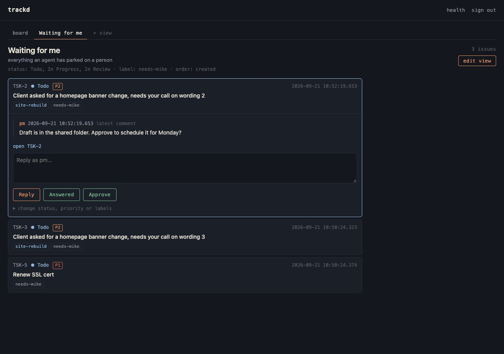

# trackd

Self-hosted task tracking for AI agents. One binary, one SQLite file, three
agent interfaces (REST, CLI, MCP) and a small web board for the people working
alongside them, usable from a phone.


> **Status: early, in daily use.** trackd runs a real multi-agent workload every
> day (several coding agents, a local-model agent and one human sharing one
> server), but it is young: expect rough edges, and read
> [Data safety](#data-safety) before trusting it with the only copy of anything.

## Why

Agents now do real work off a task list, and the tracker they work from is
also the tracker they can wreck: one confused agent, one `--force`, one
well-meant cleanup, and the history every other agent depends on is gone.
trackd starts from the opposite assumption. Agents make mistakes, so the store
has to make the mistakes harmless.

- **Nothing an agent does can destroy history.** There are no delete endpoints:
  issues are archived or canceled, never removed. Descriptions are append-only
  unless an admin asks for an overwrite in so many words. Every mutation records
  an audit event with before and after state. Backups are scheduled, verified
  with an integrity check, and taken automatically before every schema
  migration. Full-synchronous WAL writes. Plain JSONL export with a byte-exact
  round trip, so nothing is locked in.
- **Every write has a name on it.** Each agent gets its own API token, and
  every comment and audit event is attributed to it automatically. "Which agent
  did this" always has an answer.
- **Safe to retry.** Creates take an idempotency key, updates take an expected
  version, every error carries a machine-readable code and the CLI maps them to
  stable exit codes. Unknown JSON fields and unknown query parameters are
  rejected, so a typo fails loudly instead of silently doing nothing.
- **One server, every agent, and you.** Not a per-repo file and not a hosted
  service: a single process on your own machine or private network that Claude
  Code, any other MCP or HTTP client, a local model and your phone all talk to,
  for code and non-code work alike. A person approves, replies and reprioritises
  from the web board; agents do everything else through the API.
- **Boring on purpose.** Pure Go, no CGO, two direct dependencies (the SQLite
  driver and the official MCP SDK). No runtime, no containers, no external
  database, no build step. Cross-compiled for macOS, Linux and Windows.

trackd imports a Linear CSV export in one command, keys and all, if that is
where you are coming from.

## Install

Prebuilt binaries for macOS, Linux and Windows are on the
[releases page](https://github.com/mikedclarke/trackd/releases): download the
archive for your platform, unpack it, and put `trackd` on your `PATH`.

With Go 1.26 or newer installed:

```sh
go install github.com/mikedclarke/trackd@latest
```

Or from a checkout:

```sh
make build                    # writes bin/trackd, or: go build -o trackd .
make install                  # moves it to ~/.local/bin/trackd
```

## Quickstart

```sh
trackd serve --db trackd.db --backup-dir backups
```

The first run prints an admin API token to stderr. Store it, it is never shown
again. Everything lives under `/api/v1` with bearer auth:

```sh
export TRACKD_URL=http://127.0.0.1:8484 TRACKD_TOKEN=td_...

curl -s $TRACKD_URL/api/v1/issues \
  -H "Authorization: Bearer $TRACKD_TOKEN" \
  -d '{"title": "First issue", "status": "Todo"}'
```

Or use the CLI, which talks to the same server. Labels must exist before they
can be applied, so create one first:

```sh
trackd label add ready
trackd issue create --title "First issue" --status Todo --label ready
trackd issue list --label ready --order-by priority
trackd issue update TSK-1 --status "In Progress" --actor builder
trackd issue append TSK-1 --text "found the cause, see the comment" --actor builder
trackd issue comment TSK-1 --body "done, see the PR" --actor builder
trackd issue show TSK-1
```

Mint a token per agent (`trackd token add builder`) and drop the `--actor`:
writes are attributed to the token that made them.

Open the same URL in a browser for the web board. Sign in with a token and the
browser stays signed in until you sign out. Filter by project, label and
assignee, save a filter as a named view, and work a view's rows from a phone:
reply, change status, priority or labels, or press a quick action.

## Concepts, briefly

Issues have a stable key, a status, a 0-4 priority, labels, an optional
project, parent, assignee, milestone and due date, relations, comments, an
integer version and a full activity log. Descriptions are append-only. Labels
are added and removed, not replaced, and must exist before use. Statuses have a
type (`triage`, `backlog`, `unstarted`, `started`, `completed`, `canceled`).
Projects carry milestones and dates. Views are saved filters with optional
one-tap quick actions. Tokens are identities with a role, `agent` or `admin`.
Settings live in the database. The full rules, with every flag and edge case,
are in [docs/CONCEPTS.md](docs/CONCEPTS.md).

## Interfaces

### REST

Everything is under `/api/v1` with bearer auth. Issues, comments, relations, projects, milestones, labels, statuses, saved views and a global activity feed; list responses are envelopes with paging cursors; PATCH changes only the fields it includes; every error is `{"error", "code"}`; `GET /healthz` is unauthenticated. There are no DELETE endpoints by design. The ten error codes are tabled with their HTTP status and CLI exit code in [docs/API.md](docs/API.md), along with the full reference and the list filters.

### CLI

`trackd issue|comment|events|project|milestone|label|view|statuses|health` talk to a running server via `--url`/`--token` or `$TRACKD_URL`/`$TRACKD_TOKEN`; `trackd serve|token|setting|backup|restore|export|import` operate on the database file. Every client command takes `--json`, exit codes are stable (0 ok, 1 unexpected, 2 usage or validation, 3 not found, 4 auth, 5 conflict, 6 server or network), and a bare empty string is never accepted as a value, so a shell variable that did not expand cannot blank a field. On the body-bearing commands (`issue append`, `issue comment`, `comment edit`) `--text` and `--body` are interchangeable. Details in [docs/CLI.md](docs/CLI.md).

### MCP

Streamable HTTP at `/mcp`, same bearer auth, fourteen tools (`list_issues`, `get_issue`, `save_issue`, `add_comment`, `list_projects`, `save_project`, `list_milestones`, `save_milestone`, `list_labels`, `list_statuses`, `save_relation`, `list_views`, `save_view`, `list_activity`). Read tools are annotated read-only and nothing in the set is destructive. For Claude Code, add to `.mcp.json`:

```json
{
  "mcpServers": {
    "trackd": {
      "type": "http",
      "url": "http://your-host:8484/mcp",
      "headers": { "Authorization": "Bearer td_..." }
    }
  }
}
```

### Web UI

Server-rendered, embedded in the binary, and usable from a phone. A board
grouped by status with project/label/assignee filters, a tab for every saved
view, and an issue page with description, comments, relations, and the audit
trail. Sign in once with any API token.

A view page is the place to work a queue: each row opens inline to show the
latest comment, a reply box, the view's quick-action buttons, and a status,
priority and label form. Every write goes through the same store path as the
API, is attributed to the signed-in token, records the same audit event, and
carries the issue version the page was rendered with, so a change that lost a
race to another writer is refused with a notice instead of overwriting (the
reply typed with it is still saved). Views can be created and edited from the
board too (`+ view`). The issue page has the same action form beside its
comment box. The only script on any page is the issue page's "use as reply"
button.




## Data safety

- **One writer.** `serve` takes an exclusive advisory lock on the database file
  before it opens the file, so not even its integrity check or a migration runs
  against a database another trackd holds. A second server, or a `token add`,
  `token revoke`, `setting set`, `import` or `restore` aimed at a database a
  server is already serving, refuses with `another trackd is running on <path>`.
  `export`, `backup`, `token list` and
  `setting list|get` open the file read-only, so they are always safe to run
  against a live database.
- **A damaged or too-new file is refused.** `serve` runs `PRAGMA quick_check`
  before opening a database read-write and refuses a file that fails it, and an
  older binary refuses a database written by a newer one rather than migrating it
  backwards.
- `trackd serve --backup-dir <dir> [--backup-every 24h] [--backup-keep 14]
  [--backup-timeout 10m]` snapshots on startup and on the interval. Every
  snapshot is `VACUUM INTO` plus `PRAGMA integrity_check`: a backup that does not
  verify is deleted and reported, never silently kept. Backups run on their own
  database connection and are bounded by `--backup-timeout`, so a slow or hung
  backup destination can never block the API; failures show up in `/healthz`
  alongside the last good snapshot. The startup snapshot is skipped when a recent
  one already exists.
- `trackd backup` / `trackd restore <snapshot>` for manual operation. Restore
  refuses to overwrite an existing database, and refuses a destination that still
  has `-wal` or `-shm` sidecars beside it, because those hold writes the snapshot
  does not; move them aside deliberately. The restored file is verified before the
  command reports success.
- `trackd export > dump.jsonl` writes the complete database as human-readable
  JSONL; `trackd import trackd dump.jsonl` loads it into a fresh file. The
  round-trip is byte-identical and enforced by tests. This is the no-lock-in
  guarantee.
- Schema migrations snapshot the database automatically before applying, into the
  backup directory when the server has one.
- The audit log (`events`) records every mutation with actor and before/after
  state, and `trackd events` reads it as one ordered feed with a cursor.

Treat snapshots and JSONL dumps as sensitive: they contain your full issue
history and the (hashed) token table.

## Import from Linear

```sh
trackd import --db trackd.db --dry-run linear export.csv   # validate, write nothing
trackd import --db trackd.db linear export.csv
```

Imports issues (original keys preserved, key sequence continues), statuses,
text priorities, projects, assignees, milestones, labels, parent/child,
blocked-by / related / duplicate relations, and timestamps. Cycles and
initiatives are ignored. Unknown statuses are created. Dangling references are
skipped and reported, never fatal. Note: Linear's CSV export does not include
comments, so comments cannot be migrated this way.

## Running as a service

trackd binds `:8484` by default. It has no TLS of its own, so run it on a private
network (Tailscale works well) or behind a reverse proxy.

systemd (Linux):

```ini
[Service]
ExecStart=/usr/local/bin/trackd serve --db /var/lib/trackd/trackd.db --backup-dir /var/lib/trackd/backups
Restart=on-failure

[Install]
WantedBy=multi-user.target
```

launchd (macOS), as `~/Library/LaunchAgents/com.example.trackd.plist`, then
`launchctl load` it:

```xml
<?xml version="1.0" encoding="UTF-8"?>
<!DOCTYPE plist PUBLIC "-//Apple//DTD PLIST 1.0//EN" "http://www.apple.com/DTDs/PropertyList-1.0.dtd">
<plist version="1.0">
<dict>
  <key>Label</key><string>com.example.trackd</string>
  <key>ProgramArguments</key>
  <array>
    <string>/usr/local/bin/trackd</string>
    <string>serve</string>
    <string>--db</string><string>/Users/you/trackd/trackd.db</string>
    <string>--backup-dir</string><string>/Users/you/trackd/backups</string>
  </array>
  <key>KeepAlive</key><true/>
  <key>RunAtLoad</key><true/>
  <key>StandardOutPath</key><string>/Users/you/trackd/trackd.log</string>
  <key>StandardErrorPath</key><string>/Users/you/trackd/trackd.log</string>
</dict>
</plist>
```

Point `--backup-dir` at a directory that is itself synced or copied off the
machine, but note that macOS privacy protection (TCC) blocks launchd-spawned
processes from privacy-protected folders such as `~/Documents` unless you grant
the binary access in System Settings, Privacy & Security. trackd detects a
blocked backup directory and reports it in `/healthz` instead of hanging.

## Development

```sh
make build          # compiles to bin/trackd
make test           # go test -race ./...
make lint           # gofmt, go vet, and golangci-lint when it is installed
make install        # builds, then moves the binary to ~/.local/bin/trackd
make dist           # cross-compiled release archives and checksums in dist/
```

The version is a single `const` in `main.go`, bumped by hand at release time, so
`trackd version` is always a clean SemVer rather than a commit-dirtied string.
`make dist` refuses to build a release from a tree with uncommitted changes
unless you pass `ALLOW_DIRTY=1`, so a published archive always traces back to a
commit. `make install` moves a freshly built binary into place rather than
copying over the old one, which would corrupt a trackd already running from that
path.

Pure Go, no CGO (`modernc.org/sqlite`), two direct dependencies (the SQLite
driver and the official MCP SDK). Needs Go 1.26 or newer to build.

Releases are built locally with [goreleaser](https://goreleaser.com)
(`goreleaser release --clean` on a tag) or with the plain cross-compile loop in
`Makefile` (`make dist`), then attached to a GitHub release by hand. There is
no CI.

## Contributing

Bug reports and questions are welcome as issues. For anything beyond a small fix, open an issue first so the approach can be agreed before code is written; see [CONTRIBUTING.md](CONTRIBUTING.md). Security reports: see [SECURITY.md](SECURITY.md).

## License

MIT
